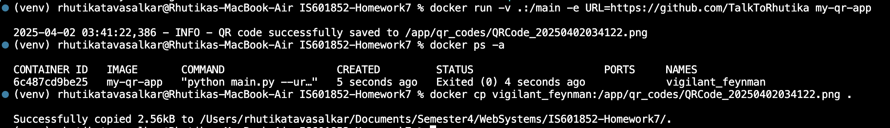

# Homework 7: Docker and Python

## This Python script generates a QR code for a given URL and saves it as an image file.

## Output: 
## 1. QR Code of My GitHub Profile

## 2. Screenshot of Log Message

