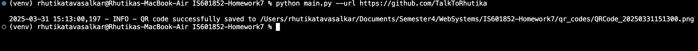

# Homework 7: Docker and Python

## This Python script generates a QR code for a given URL and saves it as an image file.

## Requirements
Install the requirements:

```
dotenv==0.9.9
pillow==11.1.0
pypng==0.20220715.0
python-dotenv==1.1.0
qrcode==8.0
typing_extensions==4.13.0
validators==0.34.0
```

## Configuration
Create a `.env` file in the project directory and add:

```
QR_CODE_DIR=custom_qr_codes
FILL_COLOR=blue
BACK_COLOR=white
```

## Usage
Run the script with:

```bash
python main.py --url "https://github.com/username"
```

## Output: 
## QR Code of My GitHub Profile


## Screenshot of Log Message


